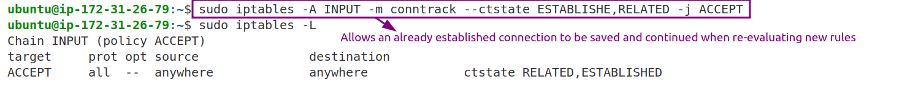
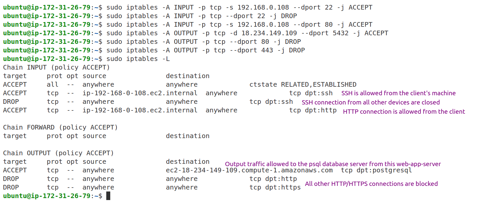

# Configure Iptables on web server, database and client's machine

iptables is the primary firewall utility program developed for Linux systems to control incoming and outgoing traffic.
This project shows how to configure iptables on 3 different machines: web-server, database and client's machine.

## Generate ssh key pair

Before creating EC2 servers, we need to create SSH key-pairs for those 2 new servers: web-server and database-server.
Please refer to the following link to find out how to create SSH key pairs. [Generate ssh key pair](https://github.com/karlakz/devops-projects/tree/main/web-server-ec2#generate-ssh-key-pair)

## Create EC2 servers

First, create a web server (application server) on EC2 instance and connect to it running the command:

```
sudo apt-get install apache2
ssh -i private_key username@ip_addr
```

To improve security of this server a network access should be restricted which can be achieved via iptabels. On Ubuntu 24.04, iptables comes preinstalled. Verify it via `iptables --version`  
If iptables does not exist, install it running the command:

```
sudo apt install iptables`
```

To list the default rules configured in the system, run:

```
sudo iptables -L
```


Before adding the rules to the table, it is a best practice to first add this rule below in order to allow already-existing SSH sessions and TCP handshakes to continue normally:

```
sudo iptables -A INPUT -m conntrack --ctstate ESTABLISHED,RELATED -j ACCEPT
```



Next, start adding the rules for the web-app-server. The client should be allowed to SSH to the web server on port 22. For this, the input rule must be configured on the web app server permitting SSH connection.

```
sudo iptables -A INPUT -p tcp -s client_ip_address --dport 22 -j ACCEPT
```

**NOTE** To find out your laptop's public ip address, run the command `curl ifconfig.me`

To drop SSH connection from the source anywhere (from all other servers), add the following INPUT rule:

```
iptables -A INPUT -p tcp --dport 22 -j DROP
```

Since the web server serves web application it should be accessible from the client's laptop on port 80, but blocked from all other servers such as DB.

```
iptabels -A INPUT -p tcp -s client_ip_address --dport 80 -j ACCEPT
```

**NOTE**: iptabels rules are implemented from top to the bottom, so the sequence the rules added are important.

The output rule is responsible for the connections initiated by this server to other systems. The application should connect to the DB server in order the application to work. To allow outgoing connection to the DB server on port 5432, add the following output rule on the web app server:

```
iptables -A OUTPUT -p tcp -d destination_ip_address --dport 5432 -j ACCEPT
```

When the session is established between the app and the postgres db, there is no need for an additional rule to be added on the web app server to accept the returning traffic. Once the connection is established data is returned back from the db to the app server ip address and a random ephemeral tcp port since we have ACCEPT rules for all ports except SSH port. To validate this, run on either the destination or source machine and search for the port 5432:

```
netstat -an | grep 5432
```

The web server should also have HTTP access to the software repo on port 80.

```
iptables -A OUTPUT -p tcp --dport 80 -d dest_ip_addr -j ACCEPT
```

To further safeguard our app server, all outgoing internet access on the web app server should be blocked.

```
iptables -A OUTPUT -p tcp --dport 80 -j DROP
iptables -A OUTPUT -p tcp --dport 443 -j DROP
```

**NOTE**: To take precedence of the drop rule, use the option `-I` which adds the rule on top of the iptables. To delete a rule, use the `-D` option and the position of the rule that must be deleted in number.

```
sudo iptables -L INPUT -v -n --line-numbers
sudo iptables -D INPUT 2
```



**NOTE**: After setting up, don't forget:

```
sudo iptables-save > /etc/iptables/rules.v4
```

(or use netfilter-persistent save if you installed it) — so rules survive reboot.

2. Next, create a database server by installing postgresql db which runs on port 5432 and verify it via


Hence the DB should accept connection only from the web app server on port 5432 and nowhere else.

```
iptabels -A INPUT -p tcp -s web_ip_addr --dport 5432 -j ACCEPT
iptables -A INPUT -p tcp --dport 5432 -j DROP
```


## How to add a backdoor port

1. EC2 machine is running on Ubuntu with socket-based activation, which changes how the SSH service is managed. Ubuntu uses systemd socket activation for SSH by default. That means:

- The `ssh.socket` is always listening on port 22
- When a connection happens, it starts `ssh.service`
- But `ssh.socket` only knows about port 22, not 2222

So even if you change `sshd_config`, systemd’s ssh.socket overrides it unless it's disabled. Disable the conflicting `ssh.socket` by running:

```
sudo systemctl stop ssh.socket
sudo systemctl disable ssh.socket
```

2. Edit config file `sudo vi /etc/ssh/sshd_config` by uncommenting `Port 22` line and adding extra line `Port 2222`. Also, uncomment `AddressFamily any` which tells `sshd` to bind to both IPv4 and IPv6 interfaces.

3. Test config file and confirm the config is valid

```
sudo sshd -t
```

✅ If there's no output, the config is valid

4. Restart SSH:

```
sudo systemctl restart ssh
```

5. Confirm it's working:

```
sudo ss -tuln4 | grep 2222   # should show IPv4 bind now
```

6. Edit and make sure EC2 SG allows port 2222 from your public IP: **EC2 > Instances > Security Group > Inbound rules > Edit inbound rules > Add Rule**

```
Custom TCP > TCP > 2222 > My IP (recommended) or 0.0.0.0/0 (not secure) > Save
```

Before packets even reach your instance, the Security Group must allow the traffic. If the Security Group blocks port 2222, then:

- No packet ever reaches iptables
- `iptables` never even sees the connection attempt
- So your `iptables` ACCEPT rule is useless

So EC2 SG is a basic AWS-level firewall while `iptables` is an instance-level firewall (your custom logic) which can be used for granular control.

7. Add iptables rule for port 2222:

```
sudo iptables -I INPUT 1 -p tcp -s YOUR_PUBLIC_IP --dport 2222 -j ACCEPT
```

8. Check your backdoor is now fully working over IPv4:

```
ssh -p 2222 ubuntu@your-ec2-public-ip
```

**NOTES**

- Forward chain is typically used in network routes to forward data to other devices in the network and it is not commonly used in Linux server.

- One machine can have multiple network interfaces (IPs): one Ethernet for the public internet (e.g., eth0), one for a private internal network (e.g., eth1), a special loopback interface, virtual machines or containers.

- To check which ports on your machine are open, run `sudo ss -tuln` where `-t = TCP`, `-u = UDP`, `-l = Listening ports`, and `-n = Don't resolve names` (show plain IPs/ports) OR `sudo nmap -sS -O localhost` which will simulate a hacker scanning your machine.

AppArmor (Application Armor) is a Linux kernel security module that restricts what programs can do or access on the system and uses profile-based access control (like rules for specific programs). Think of it like a firewall for applications:

## References

1. [phoenixap: iptables Tutorial](https://phoenixnap.com/kb/iptables-linux)
2. [DigitalOcean: Iptables Essentials](https://www.digitalocean.com/community/tutorials/iptables-essentials-common-firewall-rules-and-commands)
