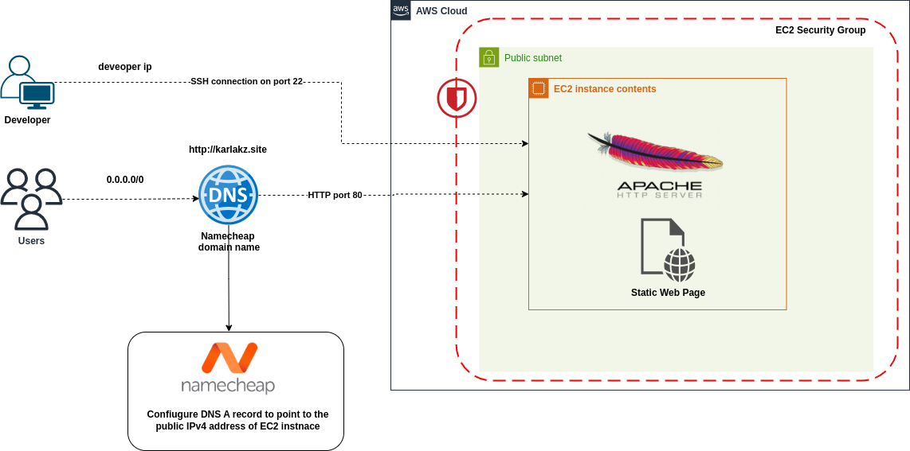

# Web server on EC2 machine with custom domain name

This project shows how to provision Apache web server on EC2 instance, configure domain name settings and deploy static web page.



## Static web page

Download static web page files from here: [HTML5 UP](https://html5up.net/)

After downloading files, unzip them inside your project directory:

```bash
unzip filename.zip
```

## Generate ssh key pair

Generate ssh key pair locally via `ssh-keygen` (For more information, see [Use SSH keys to communicate with GitLab](https://docs.gitlab.com/user/ssh/)):

```bash
ssh-keygen -t ed25519 -C ""
```

- `ssh-keygen` — the command to generate a new SSH key pair.

- `-t ed25519` — specifies the key type.

- `ed25519` is a modern, secure, and fast key algorithm (recommended over older rsa).

`-C "<comment>"` — adds a comment to the key, which is saved at the end of the public key file. The comment appears only in the .pub file, not in the file name. Use comments to distinguish between different SSH keys you have.  
If you want the **filename** to reflect the comment (like karla-ec2-key), do this when generating the key:

```bash
ssh-keygen -t ed25519 -C "karla@ec2" -f ~/.ssh/karla-ec2-key
```

That gives you:

- karla-ec2-key
- karla-ec2-key.pub

## Create EC2 instance

1. Import a public ssh key that you generated locally on your computer by choosing EC2 Dashboard -> key pair -> Import key pair. You can either upload the file or copy and paste the contents of the .pub file with `xclip`:

```
xclip -sel clip < ~/.ssh/your_public_key.pub
```

2. Install apache2 web-server and check the status of the service with:

```bash
sudo apt-get update
sudo apt-get install apache2
sudo systemctl status apache2
```


On Ubuntu, Apache serves files from `/var/www/html/`, so your homepage should be placed here.  
When copying files into the remote server with `scp` command, you might get an error when copying files directly into remote host's `/var/www/html` folder since it requires a root privileges. In that case, copy the files into the `/home/ubuntu` directory and then move files with `sudo` inside EC2 after login.

```
scp -i ~/.ssh/your-key -r ./website-files ubuntu@<your-ec2-ip>:/home/ubuntu/
```

The, move files inside EC2 with `sudo`:

```bash
sudo mv /home/ubuntu/website-files/* /var/www/html/
sudo chown -R www-data:www-data /var/www/html
```

`chown` command is all about changing file ownership, which is essential when setting up a web server like Apache. Apache (via the www-data user) needs read access (and sometimes write) to the files it serves. If files are owned by the wrong user (like ubuntu), Apache might not be able to serve your website correctly.


`chown` command ensures that Apache can read your HTML, CSS, JS files and can write (Optional) to logs or uploaded content if your site supports that.

`www-data:www-data` sets the owner and group of the files to `www-data` (the user Apache runs as)


## Configure domain name setting on Namecheap

In order to specify which IP address the domain name should address to, change the A record in the Advanced DNS section of the Namecheap Domain List.


In order to add a CNAME record, which is an alias for another domain, add the following entries in the Advanced DNS section:


In DNS settings `@` is a shortcut for your main (root) domain, e.g., karlakz.site.  
`www` is a shortcut for your subdomain. It means when someone visits `www.karlakz.site`, point it to `karlakz.site`.


To check DNS propagation after changing your A record in Namecheap, you can use:


🔗 https://dnschecker.org

Enter your domain (e.g., karlakz.site), Select A record and Click Search. You’ll see a global map showing if DNS has updated across the world.

## Troubleshooting steps:

If you are not attentive and try to open the webpage via `https`, the page might not load because Apache is listening on HTTP (port 80) only and SSL is not being set yet, so there's no certificate.

1.Ping doesn’t mean your website is down — it uses ICMP, which AWS blocks by default in security groups.

## References

- [phoenixNap Blog: How to Unzip a File in Ubuntu](https://phoenixnap.com/kb/how-to-unzip-file-linux-ubuntu)
